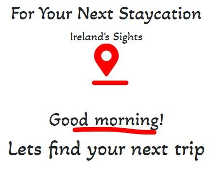

# Ireland's Sights

There are 2 goals for this website. (1) For external users coming to the site to be able to plan their next stay in Ireland. (2) To get the users coming to the website to book a travel/tour guide package of Dublin City. 

## UX

This website is mainly for people who are in Ireland who want to travel but cannot travel aboad due to Covid-19. The website is targeted to familys and indiviuals looking to plan a staycation in Ireland. 

- As an individual I want to be able to find an area in Ireland to travel to that I havent been to before. I want a range of choice and I want to see the experiences that others had before me.

- As a family we want to find an area to travel to within Ireland with a range of choice. We want to see a preview of the experiences others have had before us and the images of the locations to see if it would be possible to take small children. We would also need family rates and the option of contacting the sites owners in order to ask additional questions that might arise.

#### Wireframes:

- [Homepage](assets/img/homepage.JPG)
- [Places](assets/img/places.JPG)
- [Gallary](assets/img/gall.JPG)
- [Contact](assets/img/contact.JPG)

## Features

- A navbar for desktop that collapses into a hamburger icon for the mobile version.
- On the Homepage 3 previous users experiences with some javascript to open their testimonies when clicked on, which collapses back down when clicked again.
- On the Places page there are 2 maps using LeafletJS API's. The first shows locations throughout Ireland, the second shows Dubin City. Both maps can be interacted with.
- On the Gallary there are 9 images which can be rotated through when click on by the user. The Gallary was made with the Lightbox API.
- On the Contact page there is a submission form which allows the user to email any questions they may have. The Contact page was made with the EmailJS API.

#### Features Left to Implement

- An option for the user to book the dates they want would be useful for future developement and could probably be achieved through an API.

## Technologies Used

The website uses the following technologies and libraries:

- HTML5 for the website strcuture.
- CSS3 for the websites appearence.
- Javascript for DOM manipulation.

- Bootstrap 4
- JQuery 
- Lightbox API
- EmailJS API
- LeafletJS API

## Testing

### Homepage

For Desktop/Tablet
1. The hompage displays as intended with the locator marker expanding as the page loads 

    

2. The three experiences of previous users work correctly with the images expanding with a mouse hover and a shadow behind the image.
3. When the user clicks on John's Experience, Tom's Experience or Emma's Experience a paragraph of their experience will dropdown.
4. With a second click the paragraph will retract 

For Mobile
1. The hompage currectly does not display as intended. 
2. The 3 experiences are stacking on top of each other and are falling below the backgroun image.

### Places 

For Desktop/Tablet
1. The page displays as intended with the Leaflet API.
2. The map can be interacted with showing Sights, Hotels and Cities in the top right hand corner.
3. The map can zoom in and out on the top left hand corner.
    
4. The prices for the guided city tours show underneath with contact details for booking.

Mobile
1. Currently the map does not properly fit the screen size. * Maybe a padding/margin issue
2. The prices for the guided city tours show underneath with contact details for booking.

For Desktop/Tablet
1. The Gallery displays well on desktop.
2. The images appear small with a grey filter over them until the user hovers over an image.
    
3. When the user clicks on a photo the image expands and the user can then navigate through the photos.
    

For mobile
1. The gallary currently falls outside of the background and scews to the right on mobile.

### Contact Page

For Desktop/Tablet

1. The contact page displays well on desktop.
2. The inout fields call for the users information in order to submit an email.
3. The input fields highlight when the user hovers over them.
4. Once the user fills out the fields and clicks the submit button the information is sent using EmailJS (currently sends a mail to my personal mail)

For Mobile
1. The input fields display as intended on the mobile.
2. Once the user submits the information is sent using EmailJS
3. Currently the footer does not display as intended.

- Content kept cutting through the footer, solved it by removing a bottom of zero from the footer

## Credts:
- Logo [pixabay](https://cdn.pixabay.com/photo/2020/07/17/12/25/compass-5413948_1280.png)
- Background [HD wallpaper](https://www.wallpaperflare.com/pink-and-blue-abstract-painting-digital-art-artwork-backgrounds-wallpaper-hjbwb)

- [Quote#1](https://www.freepik.com/premium-photo/smilong-man-holiday-portrait-guy_5905917.htm)
- [Quote#2](https://pxhere.com/en/photo/540857)
- [Quote#3](https://pxhere.com/en/photo/540853)

#### Map Images:

- [Kilkenny Castle](https://pixabay.com/photos/kilkenny-castle-castle-kilkenny-3136336/)
- [Glendalough](https://www.flickr.com/photos/53400673@N08/15378477522)
- [Killarney](https://commons.wikimedia.org/wiki/File:Old_Weir_Bridge,_Killarney_National_Park.jpg)
- [Wexford](https://www.flickr.com/photos/michalo/2629154762)
- [Waterford city](https://pixabay.com/photos/travel-city-architecture-river-5205883/)
- [Galway city](https://www.galwaytourism.ie/galway-city-landmarks/)
- [Dublin city](https://www.flickr.com/photos/danielmennerich/49376836072)
- [Cork city](https://www.flickr.com/photos/infomatique/7586661082)
- [Limerick city](https://www.limerick.ie/council/services/your-council/limerick-facts-and-figures/about-limerick)
- [Cliffs of Moher](https://en.wikipedia.org/wiki/Cliffs_of_Moher)
- [Croagh Patrick](https://commons.wikimedia.org/wiki/File:Croagh_Patrick_Irland@20160531_04.jpg)
- [Giant's Causeway](https://commons.wikimedia.org/wiki/File:Giant%27s_Causeway_-_Bushmills,_Northern_Ireland,_UK_-_August_17,_2017_04.jpg)

#### Map Icons From: [MapIcons](https://mapicons.mapsmarker.com/)

#### Gallary Images:
- [Gallway](https://travelinspires.org/destinations/galway-ireland-travel-guide/)
- [Phoneix Park](https://pixabay.com/photos/ireland-dublin-phoenix-park-urban-2228961/)
- [Dublin city](https://www.osi.ie/blog/evolution-dublin-city/)
- [Cork city](https://www.tripsavvy.com/top-things-to-do-in-cork-ireland-4685203)
- [Glendalough](https://www.wallpaperflare.com/ireland-glendalough-upper-lake-landscape-nature-wicklow-wallpaper-gmnam)
- [Giant's Causeway](https://commons.wikimedia.org/wiki/File:Giant%27s_Causeway_-_Bushmills,_Northern_Ireland,_UK_-_August_17,_2017_04.jpg)
- [Cliffs Moher](https://www.wallpaperflare.com/pretty-cliffs-of-moher-county-clare-ireland-europe-wallpaper-brfxq)
- [Wexford beach](https://commons.wikimedia.org/wiki/File:Ballinesker_Beach,_CoWexford.jpg)
- [Killkenny](https://www.flickr.com/photos/harquail/40860528010)
- [Sligo](https://westerndevelopment.ie/living/counties/sligo/)
- [Achill](https://www.eurocampings.co.uk/ireland/connacht/dugort/achill-seal-caves-caravan-camping-park-112321/)
- [Castle](https://wallpapersafari.com/w/mZcnlV)

- Places page [Map](https://leafletjs.com/examples/quick-start/)

- Gallery with [lightbox](https://lokeshdhakar.com/projects/lightbox2/)

- Navbar from [Bootstrap](https://getbootstrap.com/docs/5.0/components/navbar/#toggler)

#### Email function

 - This was taken from the Code Institutes lesson under: Putting it all together > Sending Emails Using EmailJS > Sending Emails!

### Acknowledgements:
- Got help setting the footer to the bottom of the page on (https://stackoverflow.com/questions/3443606/make-footer-stick-to-bottom-of-page-correctly)
- Got help setting the text-area with (https://www.tutorialspoint.com/How-to-Create-a-Multi-line-Text-Input-Text-Area-In-HTML#:~:text=To%20create%20a%20multi%2Dline%20text%20input%2C%20use%20the%20HTML,input%20text%20over%20multiple%20rows.&text=Specifies%20that%20on%20page%20load%20the%20text%20area%20should%20automatically%20get%20focus.)
