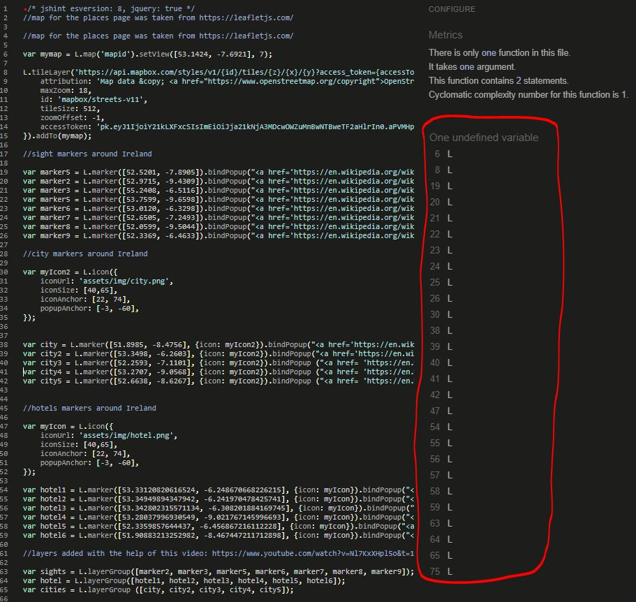

# Ireland's Sights

There are 2 goals for this website. (1) For users coming to the site to be able to plan their next stay within Ireland and to be able to book guided city tours. (2) To get the users coming to the website to book a travel/tour guide package of Dublin, Wexford, Cork or Galway city. 

## UX

This website is for people who are in Ireland who want to travel but cannot travel aboad due to Covid-19. The website is targeted to familys and indiviuals looking to plan a staycation in Ireland. 

- As a user coming to the site I want 
    - I want to see the experiences that others had before me.
    - I want to see the choice of the sights around Ireland.
    - I would want to be able to contact the sites owners easily.
    - I want individual/family price rates for the travel/tour packages.
    - I want to have ease in navigating the site. I should be easy from the moment I land on the homepage to locate and book a guided tour or to see the sites around Ireland.

- As an owner of this site I want
    - I want users to see the positive experiences that previous users have had before them (with the user experiences on the homepage)
    - I want it to be easy for users to find the page to make a booking (incited with the blow up locator on the hompage)
    - I want users to see that there are a few tour packages that they can choose from.
    - I also want them to see that there are a number of sights outside of the guided tours in the event they wish to go exporing themselves. (Shown on the interactive map)
    - I want them to be able to contact us if they need to (contact number displayed with email functionality from EmailJS)
    - Finally I want a short About Us section in the footer to provide clarity on the purpose of the website. (In the footer)

#### Wireframes:

Most of the original planning for the website has stayed in place. The general idea for the website was to have users land on the homapage and see the positive expereinces from previous users. They would then be incited to the Places page with the location marker which would expand when the hompage loaded, indicating it was clickable.   
 

Once they were on the Places page they could interacte with the map of Ireland to check out sights, cities and hotels. On that same page underneath would be the agency tour packages for city tours.
 

The gallery page was intended to present a visual image of the range of sights there are to see around Ireland. It was later decided to make the gallery more interactive with the Lightbox API. This allowed the user to select an image blow it up and scroll through them. 
 

The contact page was created with the idea of giving users the an ability to not only make a booking but to also provide a channel to give needed feedback to site owners.
 

## Features

- A navbar for desktop that collapses into a hamburger icon for the mobile version, the narbar includes a dark mode as well as page links.
- On the Homepage, there is a clickable locator which expands and there are 3 previous users experiences with some javascript to open their testimonies when clicked on, which collapses back down when clicked again.
- On the Places page there is maps using LeafletJS API. The map can be filtered to show sights, cities and hotels. It also has 4 city tours which can be clicked on to expand and collapse the info.
- On the Gallary there are 12 images which can be rotated through when clicked on by the user. The Gallary was made with the Lightbox API.
- On the Contact page there is a submission form which allows the user to email any questions they may have. The Contact page was made with the EmailJS API. (Sends an email to my personal email address at the moment)
- Onthe bottom of all pages there is a responsive footer.

#### Features Left to Implement

- An option for the user to book the dates they want would be useful for future developement and could probably be achieved through an API.

## Technologies Used

The website uses the following technologies, libraries and API's:

- HTML5 for the website strcuture.
- CSS3 for the websites appearence.
- Javascript for DOM manipulation.

- Bootstrap 4
- JQuery 
- Lightbox API
- EmailJS API
- LeafletJS API

## Testing

### Homepage

For Desktop/Tablet
1. The hompage displays as intended with the locator marker expanding as the page loads 

    

2. The three experiences of previous users work correctly with the images expanding with a mouse hover and a shadow behind the image.
3. When the user clicks on John's Experience, Tom's Experience or Emma's Experience a paragraph of their experience will dropdown.
4. With a second click the paragraph will retract 

For Mobile
1. Originally the hompage currectly did not display as intended. 
2. The 3 experiences were stacking on top of each other and were falling below the footer and backgroung image. This was corrected with some CSS tweeting of the margin/padding and height, boostraps grid also helped. Background image was also removed.

### Places 

For Desktop/Tablet
1. The page displays as intended with the Leaflet API.
2. The map can be interacted with showing Sights, Hotels and Cities in the top right hand corner.
3. The map can zoom in and out on the top left hand corner.
    
4. A description of the city tours extendeds when the user clicks on each.
5. The prices for the guided city tours show underneath with contact details for booking.

Mobile
1. Originally the map did not position correctly in the center due to a media query which has been corrected with CSS margin.
2. Occasionally I have noticed that sometimes it takes a few clicks on a sight,city or hotel marker in order for the information of that marker to display. I have not yet at this time worked out why this is.
3. On mobile both the city tour button and the paragraph underneath it would collapse together originally when clicked a second time. Although I couldnt pinpoint the problem, I ended up using Jquery code from the homepage "experience" to give the same functionality I wanted.
4. The prices and city tours show underneath with contact details for booking.

For Desktop/Tablet
1. The Gallery displays well on desktop.
2. The images appear small with a grey filter over them until the user hovers over an image.
    
3. When the user clicks on a photo the image expands and the user can then navigate through the photos.
    
4. Oringianlly my left/right arrows and close button were missing, but this was corrected with a file path update.

For mobile
1. The gallary originally fell outside of the background and scews to the right on mobile. This has been finxed with some padding/margin CSS. 
2. Background image has been removed from the beginning as it didnt present well once the gallery images were displayed in one column.

### Contact Page

For Desktop/Tablet

1. The contact page displays well on desktop.
2. The input fields call for the users information in order to submit an email and will not allow submission unless info is entered.

3. The input fields highlight when the user hovers over them.
4. Once the user fills out the fields and clicks the submit button the information is sent using EmailJS (currently sends a mail to my personal mail)

For Mobile
1. The input fields display as intended on the mobile.
2. Once the user submits the information it is sent using EmailJS
3. Oringianlly the footer did not display as intended. It has since been removed and completely redone.

#### Testing On Different Devices:
1. 24 inche dell monitor
2. 16 inche lenovo laptop
3. Galaxy S5
4. Pixel 2
5. iPhone 6/7 & 8
6. iPhone X 
7. iPad
8. Galaxy Fold

#### Testing with the HTML, CSS and Javascript Validators

Testing with the HTML/CSS validators showed a few minor errors that were then corrected.

- The Lightbox CSS was not passed in the validator as it was not written by me but is required when using the Lightbox API. I have attributed the credit for this to Lightbox and the file is clearly identified.

Testing with the JSHint validator highlighted issues that I couldnt change as the code was fufilling the functions it was intended for.

- The below issues were highlighted even though the code provides the correct functionality, I believe they are very minor issues.

The Lightbox Javascript was not passed in the validator as it was not written by me but is required when using the Lightbox API. I have attributed the credit for this to Lightbox and the file is clearly identified.

### Deployment

#### How to deploy this project:
1. Create a github account.
2. Install the Gitpod extention.
3. Navigate to the repository where the project is stored.
4. Click on the green Gitpod button to create a workplace where the project can be worked on.

#### How to clone and deploy this project:
1. Navigate to the repository where the project is stored.
2. Click on the Code button which will give the option to download the contect and the url.
3. Copy the url.
4. In your chosen IDE in the terminal type "git clone (followed by the copied url).

## Credts:
- Logo [pixabay](https://cdn.pixabay.com/photo/2020/07/17/12/25/compass-5413948_1280.png)

- [Quote#1](https://www.freepik.com/premium-photo/smilong-man-holiday-portrait-guy_5905917.htm)
- [Quote#2](https://pxhere.com/en/photo/540857)
- [Quote#3](https://pxhere.com/en/photo/540853)

#### Map Images:

- [Kilkenny Castle](https://pixabay.com/photos/kilkenny-castle-castle-kilkenny-3136336/)
- [Glendalough](https://www.flickr.com/photos/53400673@N08/15378477522)
- [Killarney](https://commons.wikimedia.org/wiki/File:Old_Weir_Bridge,_Killarney_National_Park.jpg)
- [Wexford](https://www.flickr.com/photos/michalo/2629154762)
- [Waterford city](https://pixabay.com/photos/travel-city-architecture-river-5205883/)
- [Galway city](https://www.galwaytourism.ie/galway-city-landmarks/)
- [Dublin city](https://www.flickr.com/photos/danielmennerich/49376836072)
- [Cork city](https://www.flickr.com/photos/infomatique/7586661082)
- [Limerick city](https://www.limerick.ie/council/services/your-council/limerick-facts-and-figures/about-limerick)
- [Cliffs of Moher](https://en.wikipedia.org/wiki/Cliffs_of_Moher)
- [Croagh Patrick](https://commons.wikimedia.org/wiki/File:Croagh_Patrick_Irland@20160531_04.jpg)
- [Giant's Causeway](https://commons.wikimedia.org/wiki/File:Giant%27s_Causeway_-_Bushmills,_Northern_Ireland,_UK_-_August_17,_2017_04.jpg)

#### Map Icons From: [MapIcons](https://mapicons.mapsmarker.com/)

#### Gallary Images:
- [Gallway](https://travelinspires.org/destinations/galway-ireland-travel-guide/)
- [Phoneix Park](https://pixabay.com/photos/ireland-dublin-phoenix-park-urban-2228961/)
- [Dublin city](https://www.osi.ie/blog/evolution-dublin-city/)
- [Cork city](https://www.tripsavvy.com/top-things-to-do-in-cork-ireland-4685203)
- [Glendalough](https://www.wallpaperflare.com/ireland-glendalough-upper-lake-landscape-nature-wicklow-wallpaper-gmnam)
- [Giant's Causeway](https://commons.wikimedia.org/wiki/File:Giant%27s_Causeway_-_Bushmills,_Northern_Ireland,_UK_-_August_17,_2017_04.jpg)
- [Cliffs Moher](https://www.wallpaperflare.com/pretty-cliffs-of-moher-county-clare-ireland-europe-wallpaper-brfxq)
- [Wexford beach](https://commons.wikimedia.org/wiki/File:Ballinesker_Beach,_CoWexford.jpg)
- [Killkenny](https://www.flickr.com/photos/harquail/40860528010)
- [Sligo](https://westerndevelopment.ie/living/counties/sligo/)
- [Achill](https://www.eurocampings.co.uk/ireland/connacht/dugort/achill-seal-caves-caravan-camping-park-112321/)
- [Castle](https://wallpapersafari.com/w/mZcnlV)

#### MAP API
- Places page [Map](https://leafletjs.com/examples/quick-start/)

#### Gallery API
- Gallery with [lightbox](https://lokeshdhakar.com/projects/lightbox2/)

#### Navbar
- Navbar from [Bootstrap](https://getbootstrap.com/docs/5.0/components/navbar/#toggler)

#### Email function
 - Email from [EMailJS](https://www.emailjs.com/)
 - This was set up from the Code Institutes lesson under: Putting it all together > Sending Emails Using EmailJS > Sending Emails!

### Acknowledgements:
- Got help setting the footer to the bottom of the page on (https://stackoverflow.com/questions/3443606/make-footer-stick-to-bottom-of-page-correctly)
- Got help setting the text-area with (https://www.tutorialspoint.com/How-to-Create-a-Multi-line-Text-Input-Text-Area-In-HTML#:~:text=To%20create%20a%20multi%2Dline%20text%20input%2C%20use%20the%20HTML,input%20text%20over%20multiple%20rows.&text=Specifies%20that%20on%20page%20load%20the%20text%20area%20should%20automatically%20get%20focus.)
- Desaign for the toggle night/day darkmode was taken from https://www.youtube.com/watch?v=ZZoA3MjgASQ*/ & https://www.w3schools.com/howto/tryit.asp?filename=tryhow_js_toggle_dark_mode
- Design on toggling the hompage experiences was taken from https://www.youtube.com/watch?v=WhU38HV-Iu8&t=380s
- Help on adding layers to the Leaflet map was taken from https://www.youtube.com/watch?v=Nl7KxXHpl5o&t=124s 
